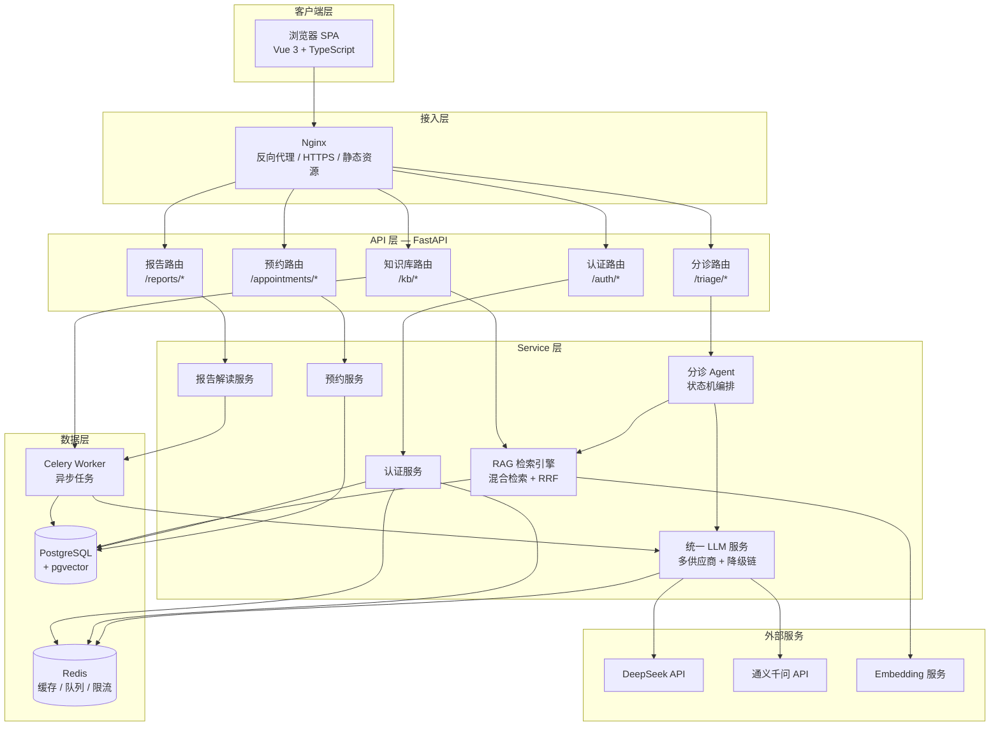
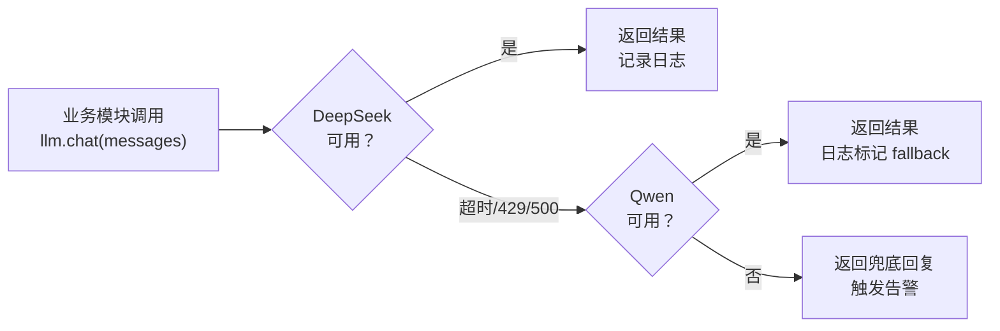
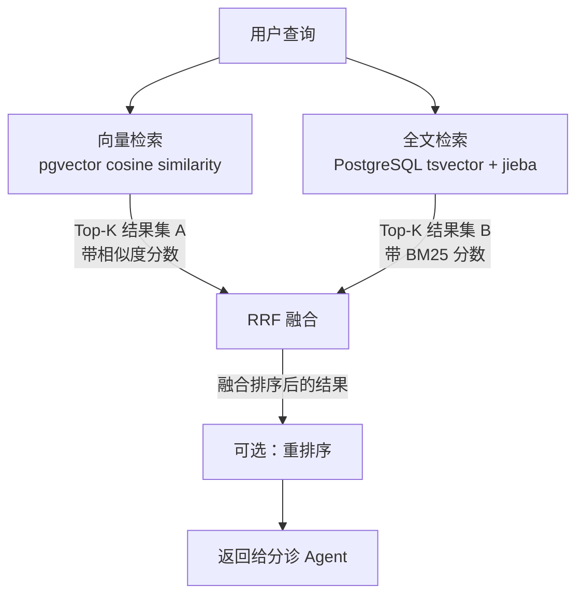
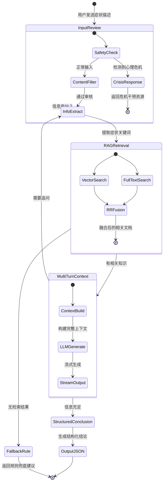
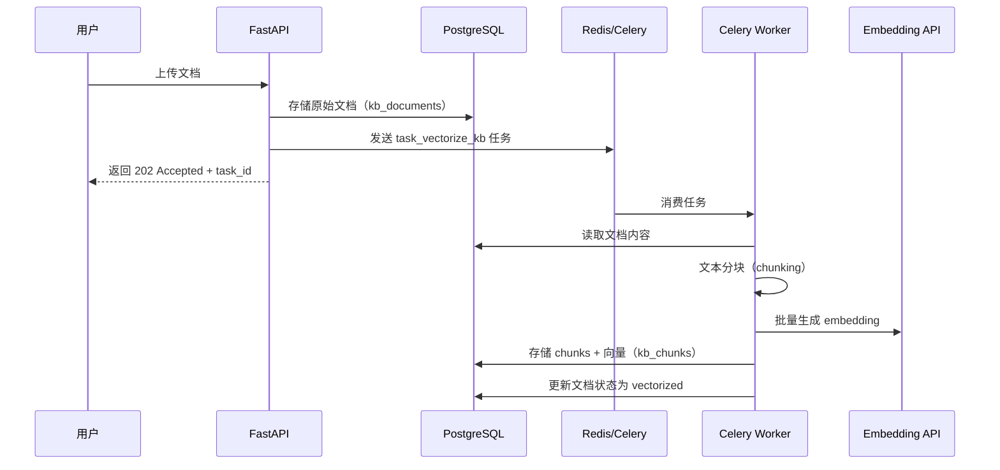
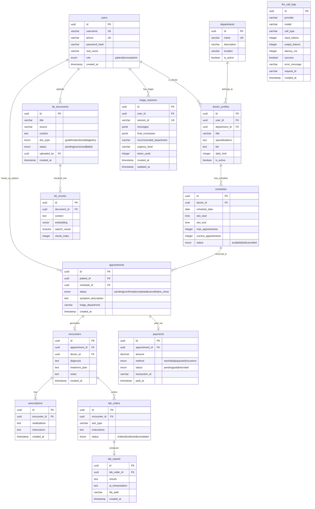

# IMCS 智能医疗预约诊疗系统 — 架构设计文档

> 本文档面向需要理解系统整体设计思路的开发者和面试准备者。不是 API 参考，而是"为什么这么设计"。

---

## 1. 系统架构全景



---

## 2. 分层架构说明

### 2.1 API 层（路由层）

**职责**：HTTP 请求的入口，负责参数校验、身份认证、响应格式化。

```
app/
  api/
    auth.py          # 注册、登录、Token 刷新
    appointments.py  # 预约挂号、取消、查询
    triage.py        # 智能分诊会话（SSE 流式）
    kb.py            # 知识库文档上传、管理
    reports.py       # 检验报告上传、解读
```

关键设计：
- **路由函数保持"薄"**：不做业务逻辑，只做 `request → pydantic 校验 → 调用 service → 返回 response`
- **统一异常处理**：通过 FastAPI 的 `exception_handler` 注册全局错误码映射
- **SSE 流式端点**：`/triage/stream` 使用 `StreamingResponse` + `text/event-stream`，前端通过 `EventSource` 消费

### 2.2 Service 层（业务逻辑层）

**职责**：核心业务编排，是系统中最重要的层。

```
app/
  services/
    llm/
      client.py      # 统一 LLM 客户端，多供应商 + 降级 + Token 预算
    rag/
      retriever.py   # 混合检索：向量 + 全文 + RRF 融合
    triage.py        # 分诊 Agent 状态机
    auth.py          # JWT 签发 / 校验 / 密码哈希
    appointment.py   # 预约排班逻辑
    report.py        # 报告解读逻辑
```

Service 层不直接操作数据库 ORM，而是通过 Repository 模式或直接依赖注入 SQLAlchemy session。这样做的好处是业务逻辑可独立测试，mock 数据层很方便。

### 2.3 数据层

**职责**：数据持久化、缓存、异步任务调度。

- **PostgreSQL + pgvector**：业务数据 + 向量存储。pgvector 让向量检索与业务查询共用同一数据库，简化运维
- **Redis**：三重角色——缓存热数据、Celery 消息队列 broker、Token 预算计数器
- **Celery**：异步任务执行引擎，处理耗时操作（知识库向量化、报告解读）

---

## 3. 统一 LLM 服务层

### 3.1 为什么集中管理

直接在业务代码里调 `httpx.post("https://api.deepseek.com/...")` 看起来更快，但在一个有多个模块需要调 LLM 的系统中，这样做会导致：

| 问题 | 集中管理的解决方案 |
|------|-------------------|
| 每个模块各自处理重试、超时 | 统一重试策略，指数退避 |
| API Key 散落各处 | 集中配置，一处轮换 |
| 无法统计 Token 消耗 | 请求/响应拦截器自动记录 |
| 供应商迁移要改 N 处代码 | 供应商抽象层，换供应商只改配置 |
| 费用失控 | 基于 Redis 的 Token 预算计数器 |

### 3.2 核心架构

```python
# 简化示意，实际代码在 app/services/llm/client.py
class LLMClient:
    """统一 LLM 调用入口"""

    providers = [
        DeepSeekProvider(api_key=settings.DEEPSEEK_API_KEY),
        QwenProvider(api_key=settings.DASHSCOPE_API_KEY),
    ]

    async def chat(self, messages: list[dict], **kwargs) -> LLMResponse:
        # 1. Token 预算检查
        if not await self._check_budget(estimated_tokens):
            raise BudgetExceededError()

        # 2. 遍历降级链
        for provider in self.providers:
            try:
                response = await provider.chat(messages, **kwargs)
                # 3. 记录调用日志
                await self._log_call(provider, request, response)
                # 4. 扣减 Token 预算
                await self._deduct_budget(response.usage.total_tokens)
                return response
            except (TimeoutError, RateLimitError, AuthError):
                logger.warning(f"Provider {provider.name} failed, trying next")
                continue

        # 所有供应商都失败
        raise AllProvidersFailedError()
```

### 3.3 预算控制

```
Redis 键设计：
  imcs:llm_budget:{date}  →  当日已消耗 Token 数（TTL 24h）

扣减流程：
  1. 估算：根据 messages 长度估算输入 Token
  2. 检查：GET imcs:llm_budget:2026-09-04
  3. 若超出限额 → 拒绝请求，返回"系统繁忙"
  4. 响应后：实际 Token 数 = input_tokens + output_tokens
  5. INCRBY imcs:llm_budget:2026-09-04 actual_tokens

Redis 不可用时：
  - 降级为"不限制"，允许请求通过
  - 在日志中记录 WARN 级别告警
  - 这是一个有意的设计取舍：宁可超预算，也不能让 Redis 故障导致整个 LLM 服务不可用
```

### 3.4 降级链工作原理



选择 DeepSeek + Qwen 的原因：
- **DeepSeek**：性价比高，中文能力强，作为主供应商
- **Qwen（通义千问）**：阿里云基础设施稳定，国内延迟低，作为降级供应商
- 两者 API 格式兼容 OpenAI，适配器代码量极小
- 不选 OpenAI 是因为国内访问不稳定，延迟高

---

## 4. RAG 混合检索

### 4.1 为什么需要混合检索

纯向量检索在医疗场景下有两个致命缺陷：

1. **精确术语匹配弱**：用户问"阿莫西林过敏能吃什么"，向量检索可能返回语义相近但药物名不同的结果
2. **Embedding 服务依赖**：如果 Embedding API 挂了，整个知识库检索就瘫痪了

混合检索通过**向量检索 + 全文检索 + RRF 融合**来兼顾语义理解和精确匹配。

### 4.2 检索流程



### 4.3 向量检索

```sql
-- pgvector 向量检索示例
SELECT chunk_id, document_id, content,
       1 - (embedding <=> $query_vector) AS similarity
FROM kb_chunks
WHERE 1 - (embedding <=> $query_vector) > 0.5  -- 相似度阈值
ORDER BY embedding <=> $query_vector
LIMIT 20;
```

- 使用余弦相似度（cosine distance）
- 向量维度与 Embedding 模型一致（通常 1024 或 1536）
- 需要在 `kb_chunks.embedding` 列上建 HNSW 或 IVFFlat 索引

### 4.4 全文检索

```sql
-- PostgreSQL 全文检索，配合中文分词
SELECT chunk_id, document_id, content,
       ts_rank_cd(search_vector, query) AS rank
FROM kb_chunks,
     plainto_tsquery('simple', $query_text) AS query
WHERE search_vector @@ query
ORDER BY rank DESC
LIMIT 20;
```

中文分词方案：**jieba 分词 + PostgreSQL `simple` 配置**。

为什么不直接用 PostgreSQL 内置的中文分词？
- PostgreSQL 的 `zhparser` 扩展安装和维护成本高
- jieba 分词更灵活，支持自定义医疗术语词典
- `simple` 配置只做最基本的语言无关处理，配合 jieba 预分词效果更好

工作流程：
1. 文档入库时，先用 jieba 分词，将结果以空格拼接存入 `search_vector` 列（`tsvector` 类型）
2. 查询时，同样用 jieba 对用户问题分词，再交给 PostgreSQL 做全文匹配

### 4.5 RRF（Reciprocal Rank Fusion）融合

RRF 的核心思想：**不看绝对分数，只看排名**。

```
RRF_score(document) = Σ 1 / (k + rank_i)

其中：
  k = 60（常用默认值，论文推荐范围 20-60）
  rank_i = 该文档在第 i 个检索器中的排名（从 1 开始）
```

**k 参数的调节**：
- k 越大 → 排名靠后的文档惩罚越小 → 结果更"平均"
- k 越小 → 排名靠前的文档权重越高 → 结果更"极端"
- 医疗场景推荐 k=60，因为宁可多给候选结果，也不要漏掉关键信息

**为什么不直接合并分数？**
- 向量检索的余弦相似度和全文检索的 BM25 分数量纲不同，直接加权无意义
- RRF 只看排名，天然解决了跨检索器分数不可比的问题

### 4.6 Embedding 服务降级

当 Embedding 服务不可用时，系统自动降级为纯全文检索模式：

| 条件 | 向量检索 | 全文检索 | 最终策略 |
|------|---------|---------|---------|
| Embedding 正常 | 开 | 开 | RRF 融合 |
| Embedding 不可用 | 跳过 | 开 | 仅 BM25 |

---

## 5. 智能分诊 Agent

### 5.1 为什么是"Agent"而不只是"聊天"

分诊不是简单的问答——它需要：
- 理解用户描述的症状，判断信息是否完整
- 主动追问缺失信息（发病时间、伴随症状、既往史）
- 检索医学知识库辅助判断
- 最终输出结构化的分诊结论（科室推荐、紧急程度、就医建议）

这些"主动行为"让它超越了一般的 RAG 问答，具备了 Agent 的特征。

### 5.2 状态机工作流



### 5.3 各阶段详解

**阶段 1：输入审核（Input Review）**

| 检查项 | 处理方式 |
|--------|---------|
| 空输入 / 纯表情 / 过短 | 提示用户详细描述症状 |
| 心理危机关键词 | 立即返回心理援助热线，不进入分诊流程 |
| 广告 / 无关内容 | 礼貌拒绝，引导回到症状描述 |
| 注入攻击尝试 | 过滤并记录日志 |

心理危机检测是硬编码的规则匹配（关键词 + 正则），不依赖 LLM，确保零延迟响应。

**阶段 2：信息提取与 RAG 检索**

从用户输入中提取：
- 主诉（chief complaint）
- 症状持续时间
- 伴随症状
- 既往病史（如果用户提到）

用提取的关键词进行 RAG 检索，获取相关的医学知识。

**阶段 3：多轮上下文构建**

```
System Prompt（分诊角色设定 + 输出格式要求）
  +
历史对话消息（用户+助手的多轮交互）
  +
RAG 检索结果（相关医学知识片段）
  +
当前轮用户输入
```

**阶段 4：流式输出**

使用 SSE（Server-Sent Events）将 LLM 的生成结果实时推送给前端，改善用户等待体验。

**阶段 5：结构化结论**

LLM 最终输出必须符合预定义的 JSON Schema：

```json
{
  "department": "心内科",
  "urgency": "建议尽快就医",
  "chief_complaint_summary": "胸闷气短，活动后加重，持续3天",
  "possible_conditions": ["冠心病", "心律失常"],
  "recommendations": ["建议做心电图", "避免剧烈运动"],
  "disclaimer": "本分诊结果仅供参考，不构成诊断"
}
```

如果 LLM 输出的 JSON 不合法，系统会：
1. 尝试从自由文本中正则提取关键字段
2. 如果仍失败，返回规则兜底模板

**阶段 6：规则兜底**

当 RAG 无结果且 LLM 无法给出可靠结论时，根据预设的关键词→科室映射表返回通用建议。这不是最佳结果，但保证了系统不会"什么都不说"。

---

## 6. 异步任务架构

### 6.1 两个核心任务

| 任务名 | 触发方式 | 耗时 | 资源消耗 |
|--------|---------|------|---------|
| `task_vectorize_kb` | 文档上传时 | 数秒~数分钟 | Embedding API 调用 |
| `task_interpret_report` | 报告上传时 | 10-30 秒 | LLM API 调用 |

### 6.2 为什么用 Celery 而不是 FastAPI BackgroundTasks

- **持久化**：Celery 任务有状态，服务重启后可以重试；BackgroundTasks 随进程消亡
- **并发控制**：Celery Worker 可以独立扩容，不影响 API 服务的响应能力
- **监控**：Flower 面板可以直观看到任务队列深度、失败率、执行时间
- **重试机制**：Celery 内置指数退避重试，网络抖动时自动恢复

### 6.3 任务流程示例：知识库向量化



---

## 7. 数据模型 ER 图



---

## 8. 设计取舍

### 8.1 为什么不用 LangChain

| 维度 | LangChain | 本项目方案 |
|------|-----------|-----------|
| 抽象层级 | 高度抽象，"魔法"多 | 显式调用，代码可读 |
| 依赖 | 包体积大，版本迭代激进 | 仅 httpx + pydantic |
| 调试 | 链式调用堆栈深，难定位 | 每一步都是普通函数调用 |
| 定制 | 需要覆盖大量基类 | 直接写业务逻辑 |
| 学习成本 | 需要学习一套框架 API | 只需要懂 Python 异步编程 |

结论：LangChain 适合快速原型验证，但在一个对可控性、可调试性有要求的生产系统中，手写 200 行 LLM 客户端代码比引入一个不断 breaking change 的框架更可靠。

### 8.2 为什么用状态机而非 ReAct

| 维度 | ReAct | 状态机 |
|------|-------|--------|
| 确定性 | LLM 自主决策下一步 | 预定义的状态转移，行为可预测 |
| 调试 | 难以复现问题 | 状态转移有日志，问题可追溯 |
| Token 消耗 | 每步都需要 LLM 推理 | 部分状态转移是规则驱动，不消耗 Token |
| 安全性 | LLM 可能"跑偏" | 每个状态的输入输出有严格约束 |
| 灵活性 | 高，LLM 可以自由组合工具 | 较低，新增流程需要改状态转移图 |

医疗场景对安全性和可预测性的要求远高于灵活性。状态机让每一步都可审计——这对医疗系统来说是刚需。

### 8.3 为什么 Celery 用同步 SQLAlchemy

这是一个看似矛盾但实际合理的决定：

**背景**：FastAPI 主应用使用 `asyncpg`（异步 PostgreSQL 驱动），但 Celery Worker 使用 `psycopg2`（同步驱动）。

**原因**：
1. Celery 的任务函数天然是同步的，要让 Worker 运行异步代码需要额外的事件循环管理
2. 每个 Celery Worker 是独立进程，不存在"阻塞 API 事件循环"的问题
3. 同步驱动在批处理场景下性能足够，且更容易调试
4. 两套数据库连接配置通过环境变量 `DATABASE_URL`（async）和 `DATABASE_URL_SYNC`（sync）区分

```python
# FastAPI 使用异步引擎
async_engine = create_async_engine(settings.DATABASE_URL)

# Celery 使用同步引擎
sync_engine = create_engine(settings.DATABASE_URL_SYNC)
```

---

## 附录：技术选型速查

| 组件 | 选型 | 选择理由 |
|------|------|---------|
| Web 框架 | FastAPI | 异步原生、自动 OpenAPI 文档、Pydantic 集成 |
| 数据库 | PostgreSQL + pgvector | 业务数据 + 向量存储一体化，减少运维组件 |
| 缓存/队列 | Redis | 轻量、Celery 原生支持、可做限流计数器 |
| 任务队列 | Celery | 成熟稳定、监控工具完善（Flower）、重试机制 |
| 前端 | Vue 3 + TypeScript | 类型安全、组合式 API 适合复杂交互 |
| 分词 | jieba | 中文分词事实标准、支持自定义词典 |
| LLM | DeepSeek + Qwen | 性价比 + 国内稳定访问 + API 兼容 |
| 容器化 | Docker Compose | 开发环境一键启动，生产环境可迁移至 K8s |
